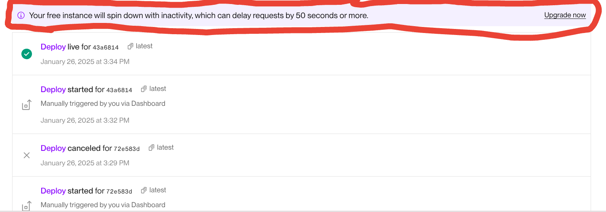

# CapxRepo

## Overview
CapxRepo is a full-stack web application that allows users to manage their stock portfolios. Built with React.js on the frontend and Spring Boot on the backend with postgre as database, it offers features like viewing real-time stock prices, adding/removing stocks from the portfolio, and personalized stock recommendations. The app integrates the Finhub API to fetch real-time stock data and uses JWT-based authentication to manage user accounts.
- **Live Demo**: [CapGro](https://capgro.netlify.app/)
- Use Credentials for login (username - naman@123 , password- Naman@123) or you can signup as per your preference.
- **Note**: The backend is deployed on the free tier of the Render platform, which may result in some delays in loading data, particularly during the first run or when the server has been idle. Please allow at least 50 seconds or more for the data to appear initially. .

## Features
- **Real-Time Stock Price Updates**: Uses Finhub API to display live stock data.
- **Stock Portfolio Management**: Users can add, update, and delete stocks in their portfolio.
- **Sign-Up & Authentication**: Users must sign up to purchase stocks. A token-based authentication system is used.
- **Portfolio Summary**: Track all purchased stocks, view detailed portfolio performance, and receive stock recommendations.
- **Stock Search**: Users can search for stocks by name or ticker.

## Technologies Used
-   **Frontend**: React.js, Axios (for API calls)
-   **Backend**: Java Spring Boot, Spring Security (for authentication)
-   **Database**: POSTGRE SQL
-   **API Integration**: Finhub API (for real-time stock data)
-   **Authentication**: JWT (JSON Web Tokens)
-   **Deployment**: 
         1.**Frontend**: Deployed on Netlify
         2.**Backend** : Deployed on Render
         3.**Database**: Deployed on Neon

-   **Containerization**: Docker (used for efficient deployment and management)

## Prerequisites

Before setting up the project, ensure you have the following installed:

-   **Node.js**: For running the frontend
-   **Maven**: For building the backend
-   **Java**: Java 8 or higher
-   **Database**: POSTGRE SQL
-   **Docter**: for Containerization

## SignUp Pattern:

- When creating an account, ensure the following patterns are followed:

-   **Username**: Must include an alphanumeric string with special characters.
                  Example: `naman@123`
-   **Password**: Must be at least 8 characters long, including:
                  At least one uppercase letter
                  At least one lowercase letter
                  At least one digit
                  At least one special character
                  Example: `Naman@123`

## Installation

### Frontend Setup (React)

1.  Clone the repository:

    `git clone https://github.com/namanjain2602/CapxRepo.git
    cd CapxRepo/frontend` 
    
2.  Install dependencies:
3. 
    `npm install` 
    
4.  Start the React development server:

    `npm start` 
    
    The app will be accessible at `http://localhost:3000`.
    

### Backend Setup (Spring Boot)

1.  Navigate to the backend folder:
    
    `cd CapxRepo/backend` 
    
2.  Build and run the Spring Boot application:
    
    `mvn spring-boot:run` 
    
3.  The backend API will be accessible at `http://localhost:8080`.  

## Docker Setup

- Ensure Docker is installed and running on your machine.
- Use the provided Dockerfiles for the frontend and backend services to create containers:
  `docker-compose up`
- This will start all services, including the frontend, backend, and database, within containers.
    
## Usage

1.  **Frontend**: Open the application in the browser by visiting `http://localhost:3000`.
    
    -   Users can explore stock data without signing up.
    -   To purchase stocks, users must sign up and log in.
    -   Purchased stocks will be displayed in the portfolio section.
2.  **Backend**: The backend API handles the stock portfolio, user authentication, and real-time stock data.

## API Endpoints

-   **POST /api/stocks**: Add a stock to the portfolio (requires JWT token).
-   **PUT /api/stocks/{id}**: Update stock details in the portfolio.
-   **DELETE /api/stocks/{ticker}/{quantity}**: Remove a stock from the portfolio (requires JWT token).
-   **GET /api/stocks**: Retrieve all stocks in the user's portfolio.
-   **GET /api/stocks/portfolio-details**: View detailed portfolio information.
-   **GET /api/stocks/recommendations**: Get recommended stocks based on trends and user preferences.
-   **GET /api/stocks/search**: Search stocks by ticker or name.
-   **GET /api/stocks/details/{ticker}**: Get detailed information for a specific stock.

## Authentication

-   User registration is required to purchase stocks. Upon signing up, users will receive a JWT token to authenticate their requests.
-   Use the `Authorization` header to pass the token as `Bearer <token>` in API requests.

## Deployment

-   The project is deployed and accessible at the following link:
-   Live Demo: [CapGro Live](https://capgro.netlify.app/)

## License
This project is licensed under the MIT License - see the LICENSE file for details.

